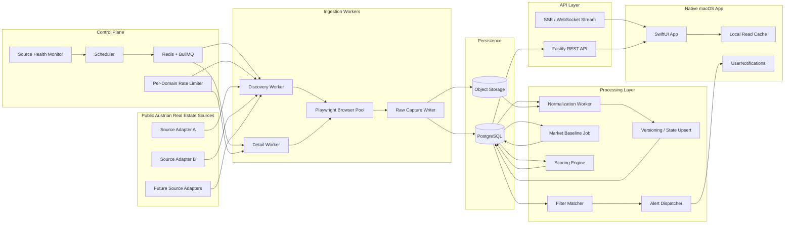
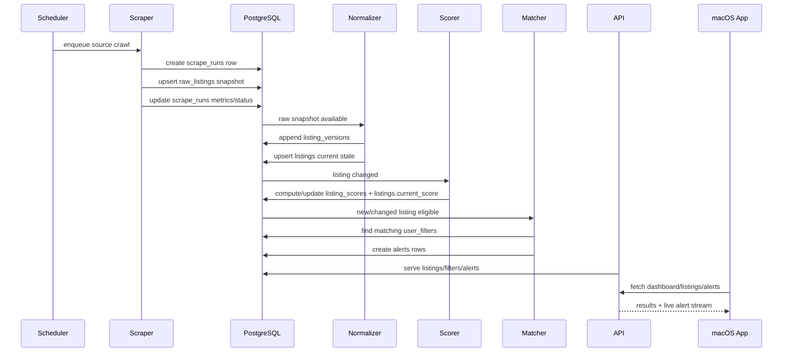

# architecture.md

## 1. System stance

This system is not designed as a foreground desktop scraper.

The production design is **backend-first, macOS-native client on top**:

- **always-on ingestion** runs as background services
- **Swift macOS app** is the native operator and investor workstation
- **TypeScript services** perform scraping, normalization, scoring, alerts, and API delivery
- **PostgreSQL** is the system of record
- **object storage** preserves heavy raw artifacts (HTML, screenshots, HAR, attachments)
- **Redis + BullMQ** coordinate durable background jobs with retries and backoff

This is the most reliable way to satisfy all constraints at once:

1. always-on crawling
2. robust anti-bot handling
3. strong typing in the backend
4. native macOS UX
5. clear separation of concerns

For single-user/self-hosted deployments, the backend services can run on a **Mac mini** as launchd daemons or in Docker. For more robust operation, run them on a VPS or dedicated host and keep the macOS app as the control plane.

---

## 2. Primary engineering decisions

### 2.1 Source isolation
Every website has its own scraper package with its own:

- selectors
- pagination rules
- URL builders
- anti-bot settings
- raw DTO schema
- tests
- fixture set
- health checks

No selector or DOM assumption is shared across sites.

### 2.2 Raw-first ingestion
The scraper never writes directly into the canonical `listings` table.

It writes to:

1. `scrape_runs`
2. `raw_listings`
3. optional object storage artifacts

Normalization happens later in a separate step.

### 2.3 Current-state + history model
Use two layers:

- `listings`: current canonical state
- `listing_versions`: immutable normalized history

This supports:

- price-drop detection
- content-change detection
- listing age / time-on-market
- replaying scoring logic later
- debugging normalization regressions

### 2.4 Idempotent writes
Idempotency is enforced by database constraints and deterministic keys:

- source-local stable key: `(source_id, source_listing_key)`
- raw snapshot uniqueness: `(source_id, source_listing_key, content_sha256)`
- alert dedupe key: `(filter, listing, alert_type, score_version)`

### 2.5 Native macOS feel
The Swift app should look and behave like a professional Mac productivity app:

- SwiftUI-first
- sidebar navigation
- searchable list/detail split view
- native table sorting
- keyboard shortcuts
- menu bar alert count
- local notifications
- background refresh of read models
- Keychain storage for auth token / local credentials

---

## 3. High-level system diagram



---

## 4. End-to-end data flow



### 4.1 Detailed flow

1. **Scheduler** reads active sources and crawl profiles.
2. A **discovery worker** loads search/result pages and extracts listing cards.
3. A **detail worker** visits each listing detail page and captures:
   - raw field DTO
   - canonical URL
   - source-local listing key
   - response metadata
   - optional HTML/screenshot/HAR reference
4. Raw data is stored in `raw_listings`.
5. A **normalization worker** converts source DTOs into canonical form.
6. `listing_versions` receives a new immutable version when content or status changed.
7. `listings` is upserted with the latest canonical state.
8. A **baseline job** calculates district / bucket medians.
9. A **scoring worker** assigns a 0–100 score and stores explanation data.
10. A **filter matcher** evaluates active saved filters against the changed listing.
11. Matching events produce `alerts`.
12. The **API** exposes read models to the Swift app.
13. The **macOS app** renders saved searches, scores, source health, alerts, and analytics.

---

## 5. Separation of concerns

## 5.1 Scraping layer
Responsible for:

- navigation
- pagination
- DOM/data extraction
- anti-bot pacing
- retries
- raw DTO generation
- raw artifact capture
- source health metrics

Not responsible for:

- district inference
- canonical price parsing rules shared across sources
- scoring
- alerting
- user-facing filtering semantics

## 5.2 Normalization layer
Responsible for:

- field parsing
- canonical schema mapping
- Vienna district normalization
- numeric coercion
- derived metric creation
- change detection
- idempotent state upsert

Not responsible for:

- browser behavior
- alert fanout
- UI formatting

## 5.3 Scoring layer
Responsible for:

- market baseline computation
- opportunity ranking
- keyword signals
- time-on-market logic
- explanation payloads

Not responsible for:

- filtering criteria persistence
- sending notifications

## 5.4 Filtering / alert layer
Responsible for:

- stored filter criteria
- match evaluation
- dedupe
- alert delivery state

Not responsible for:

- scraping or field parsing

## 5.5 API layer
Responsible for:

- typed read/write endpoints
- cursor pagination
- auth
- live events for UI
- query translation

Not responsible for:

- direct scraping
- normalization
- score computation

## 5.6 Swift macOS app
Responsible for:

- native user experience
- saved search management
- list/detail visualization
- system notifications
- offline-friendly read cache

Not responsible for:

- primary ingestion scheduling
- direct DB writes
- browser automation

---

## 6. Scraper architecture

## 6.1 Core abstraction

Each source implements a `SourceAdapter` contract:

```ts
export interface SourceAdapter<TDiscoveryDTO, TDetailDTO> {
  readonly sourceCode: string;
  readonly sourceName: string;

  buildDiscoveryRequests(input: CrawlProfile): Promise<RequestPlan[]>;
  extractDiscoveryPage(ctx: DiscoveryContext): Promise<DiscoveryPageResult<TDiscoveryDTO>>;
  buildDetailRequest(item: DiscoveryItem<TDiscoveryDTO>): Promise<RequestPlan | null>;
  extractDetailPage(ctx: DetailContext): Promise<DetailCapture<TDetailDTO>>;
  deriveSourceListingKey(input: DetailCapture<TDetailDTO>): string;
  canonicalizeUrl(url: string): string;
  detectTerminalStatus(ctx: DetailContext): SourceTerminalStatus;
}
```

### 6.2 Per-source package layout

```text
packages/source-willhaben/
  src/
    adapter.ts
    discovery.ts
    detail.ts
    selectors.ts
    dto.ts
    cookies.ts
    fingerprints.ts
    health.ts
    fixtures/
    tests/
```

### 6.3 Discovery vs detail split
Do not depend only on search cards.

Use two-stage crawling:

1. **discovery pages** enumerate candidates cheaply
2. **detail pages** capture richer fields and more stable identifiers

This improves:

- completeness
- dedupe quality
- source-local ID extraction
- change detection

### 6.4 Crawl profiles
Define explicit crawl profiles:

- `vienna_priority_buy_apartments`: every 10–15 minutes
- `vienna_full_buy`: every 30–60 minutes
- `austria_broad_scan`: every 2–6 hours
- `backfill`: low priority, throttled
- `recovery`: manual re-run of failed pages

This lets Vienna investor-critical segments refresh faster without overloading sources.

---

## 7. Scheduling and orchestration

## 7.1 Why BullMQ + Redis
Chosen because it is:

- simple to operate
- durable enough for this workload
- good fit for TypeScript
- supports retries, priorities, backoff, rate limiting
- easier to self-host than Temporal for a single-team system

### 7.2 Queues
Use separate queues:

- `crawl.discovery`
- `crawl.detail`
- `normalize.raw-listing`
- `score.listing`
- `alerts.match`
- `alerts.dispatch`
- `maintenance.source-health`
- `maintenance.baselines`

### 7.3 Job boundaries
One `scrape_run` should be traceable and bounded.

Recommended unit of work:

- one discovery page job
- one detail page job
- one normalization job per raw snapshot
- one scoring job per listing version
- one alert matching job per changed listing

Avoid giant multi-hour jobs that fail halfway with no replay boundary.

### 7.4 Rate limiting
Enforce domain-specific limits in the scheduler, not inside ad-hoc scraper code.

Per source config should include:

- max parallel contexts
- requests per minute
- cool-down after 403/429/CAPTCHA
- crawl windows if needed
- retry policy

### 7.5 Recovery model
If a worker crashes:

- queued jobs remain in Redis
- the DB remains the source of truth
- partially completed runs are marked `partial` or retried
- idempotent upserts prevent duplicate data

---

## 8. Storage design

## 8.1 PostgreSQL
Primary system of record for:

- source registry
- scrape run audit
- raw listing metadata
- canonical current listings
- normalized history
- saved filters
- alert state
- score history
- market baselines

### 8.2 Object storage
Store heavy artifacts outside PostgreSQL:

- gzipped HTML snapshots
- screenshots on parse failure
- HAR/network traces
- optional downloaded images or brochures

PostgreSQL stores the metadata pointer and checksums.

### 8.3 Redis
Used only for:

- job queue state
- transient scheduling
- short-lived dedupe locks / circuit breakers

Redis is **not** the source of truth.

### 8.4 Local app cache
The macOS app should maintain a local read cache for:

- recent listings
- saved filters
- alerts
- lookup data (district names, property types)

Use SwiftData or SQLite-backed storage. Treat it as a cache, not authoritative state.

---

## 9. Listing lifecycle model

A listing moves through these states:

1. `active`
2. `inactive`
3. `withdrawn`
4. `sold` / `rented`
5. `expired`
6. `unknown`

### 9.1 Transition rules
Examples:

- still present in discovery/detail => remain `active`
- detail page says unavailable / removed => `withdrawn`
- explicit sold/rented marker => terminal status
- missing from N consecutive full crawls => `inactive`
- reappears later with same source key => reactivate existing listing row and append version

### 9.2 Relist handling
Source-local relists should not create a new canonical row if the site reuses the same ID.

For changed IDs or cross-source duplicates, do **not** auto-merge into one listing in v1. Instead, preserve separate listings and add cross-source clustering later. False merges are more dangerous than duplicate candidates.

---

## 10. API layer

## 10.1 Style
Use REST first, documented with OpenAPI. Generate a typed Swift client from the OpenAPI contract.

Why REST over GraphQL initially:

- simpler cache semantics
- easier cursor pagination
- strong compatibility with generated clients
- better operational simplicity
- better fit for explicit investment workflows

### 10.2 Core API responsibilities

- listing search and detail
- filter CRUD
- alert feed and alert acknowledgement
- source health visibility
- scrape run visibility
- market baseline analytics
- score explanation endpoint

### 10.3 Realtime
Use either:

- **Server-Sent Events (preferred initially)** for new alerts / source health changes
- WebSockets later if two-way interactions become necessary

---

## 11. Native macOS application architecture

## 11.1 UI modules

- **Dashboard**: counts, recent high-score listings, source health, failed runs
- **Listings**: searchable table and detail pane
- **Saved Filters**: create/edit investment criteria
- **Alerts**: unread matches, price drops, score upgrades
- **Sources**: enabled sites, crawl cadence, last success, parse health
- **Analytics**: district medians, trend charts, scoring explanation
- **Settings**: tokens, notification preferences, local/remote backend mode

## 11.2 App architecture
Recommended pattern:

- SwiftUI views
- observable feature state
- service layer for networking
- Codable DTOs from OpenAPI-generated client
- local cache / repository layer
- UserNotifications integration
- no business logic inside views

## 11.3 Native feel requirements
Use:

- `NavigationSplitView`
- `Table`
- `Inspector`
- `Searchable`
- `Commands` for keyboard shortcuts
- `MenuBarExtra` for quick alert access
- `NSWorkspace` integration for opening listing URLs
- `QuickLook` / preview for stored artifacts if exposed

---

## 12. Observability and operations

## 12.1 Metrics
Track at least:

- crawl success rate by source
- time to first byte / page load time
- parse success rate
- raw snapshots created
- normalized versions created
- listing update rate
- score computation latency
- alert delivery success rate
- source block / CAPTCHA frequency

## 12.2 Logs
Structured logs with correlation IDs:

- `source_code`
- `scrape_run_id`
- `listing_key`
- `job_id`
- `worker_host`
- `error_class`

### 12.3 Failure artifacts
On parse failure or suspected DOM change, capture:

- URL
- screenshot
- HTML snapshot
- selector diagnostics
- error class
- worker/browser version

### 12.4 SLOs
Practical initial targets:

- high-priority Vienna crawl freshness: < 20 minutes
- source success rate: > 95% on enabled sources
- alert delivery lag for instant filters: < 2 minutes after scoring
- API p95 listing search latency: < 300 ms for common filters

---

## 13. Security and compliance

- Store secrets in environment/secret manager, never in source control.
- Keep auth tokens in macOS Keychain and server-side secret store.
- Encrypt object storage at rest.
- Do not bypass authentication walls or CAPTCHAs.
- Treat `raw_listings` as potentially sensitive operational data.
- Avoid logging full HTML bodies unless explicitly needed for debug storage.
- Perform legal review per source before enabling production crawling.

---

## 14. Future extensibility

The design intentionally leaves room for:

### 14.1 Analytics
- district trend lines
- seller behavior analysis
- price-drop frequency
- source quality comparisons
- heat maps by district / postal code

### 14.2 ML
- ranking model trained from investor feedback
- text embeddings for similar listing detection
- renovation opportunity classifier
- duplicate clustering across sources
- geospatial desirability model

### 14.3 Automation
- webhook export to Notion/Airtable/Slack
- automatic due diligence queue creation
- watchlists
- saved comparison boards
- CSV / XLSX export
- broker outreach workflows

### 14.4 Geospatial enrichment
- U-Bahn distance
- school / hospital / green space proximity
- flood zone overlays
- zoning / land-use enrichment
- transit score approximations

---

## 15. Final architecture recommendation

Build the system as a **three-layer product**:

1. **scraping and processing backend** (always-on, TypeScript)
2. **typed REST API** (TypeScript)
3. **native Swift macOS client** (operator experience)

Do not make the desktop app responsible for being the only always-on execution environment. Let the app feel native, but keep operational continuity in headless services.
