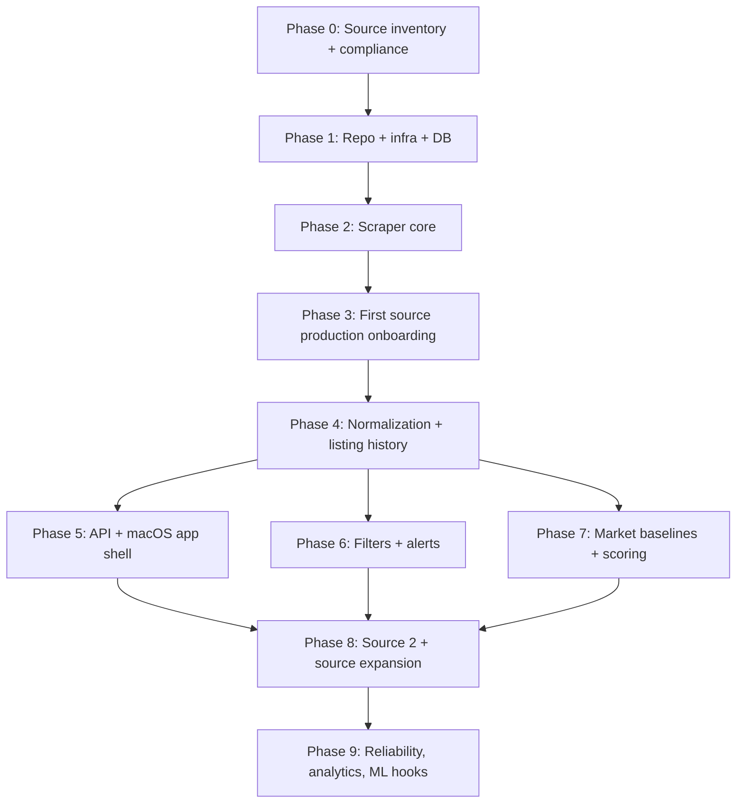

# buildplan.md

## 1. Delivery philosophy

Build this in layers that create usable value early without painting the system into a corner.

The correct order is:

1. platform foundations
2. raw capture and auditability
3. one production-quality source
4. canonical model and history
5. API + native app shell
6. filters + alerts
7. scoring + analytics
8. second source
9. hardening and scale-out

Do **not** start with “smart ranking” or broad source coverage before the ingestion core is stable.

---

## 2. Phase dependency map

---

## 3. Phase 0 — Source inventory, legal review, and success criteria

### Objectives

- define initial target sites
- document allowed/public entry points
- define crawl cadence and source priority
- decide operating mode: local daemon on Mac mini vs remote host
- define objective acceptance criteria

### Deliverables

- source inventory document
- per-source risk and feasibility sheet
- crawl policy matrix
- final choice of first source
- final choice of deployment mode
- initial KPI/SLO set

### Required decisions

- source codes and names
- target segments: Vienna apartments for sale first
- high-priority districts: e.g. 1020, 1030, then broader Vienna
- whether detail pages expose stable IDs
- whether source embeds JSON, JSON-LD, or only DOM text
- legal review status per source

### Anti-bot considerations to address now

- does the source tolerate low-rate browser access?
- are listings discoverable via public search pages?
- is cookie consent required before selectors are stable?
- are there aggressive bot walls or only light throttling?
- can the source be polled incrementally, or only via paginated full scans?

### Exit criteria

- first source selected
- crawl policy approved
- architecture approved
- legal/compliance review done for first source
- success criteria written down

### Why this phase matters

A production scraper fails most often because teams skip source profiling and discover too late that a site has:

- no stable IDs
- strong bot walls
- highly volatile DOM
- or terms that require a different ingestion approach

### Phase 0 completion (2026-03-21)

All deliverables are in `docs/phase0/`:
- `source-inventory.md` — 7 sources profiled, willhaben selected as first
- `risk-feasibility.md` — per-source technical and legal risk assessment with robots.txt findings
- `crawl-policy-matrix.md` — rate limits, intervals, priorities per source
- `kpi-slo.md` — freshness, reliability, alert lag, API perf, data quality targets
- `deployment-decision.md` — Mac mini daemon, Docker Compose
- `first-source-decision.md` — willhaben first, with evaluation matrix and onboarding order

Exit criteria status: all met. See `docs/checklist.md` Section 0.

---

## 4. Phase 1 — Repository, infrastructure, and database foundations

### Objectives

Create the operational base before writing site-specific logic.

### Deliverables

- monorepo scaffold
- CI pipeline
- PostgreSQL migrations
- Redis/BullMQ setup
- object storage setup
- OpenTelemetry / structured logging
- secrets strategy
- base configuration model
- local docker-compose for development

### Work items

#### Backend foundation
- choose package manager and workspace layout
- configure strict TypeScript
- configure linting, formatting, test runner
- create shared config package
- create DB package and migration tooling
- create OpenAPI-first API package skeleton

#### Infra foundation
- PostgreSQL instance
- Redis instance
- object storage bucket structure
- environment config loading
- health endpoint and readiness checks
- log aggregation target
- backup plan

#### Database foundation
- implement `sources`
- implement `scrape_runs`
- implement `raw_listings`
- implement `listings`
- implement `listing_versions`
- implement `user_filters`
- implement `alerts`
- implement `market_baselines`
- implement `listing_scores`

### Dependencies

- none; this is the actual starting point

### Exit criteria

- migrations run cleanly from zero
- local environment boots with one command
- CI runs lint + unit tests + migrations
- structured logs visible
- API skeleton reachable
- DB backup and restore tested once

### Common failure to avoid

Do not wait until after scraping starts to design the schema. Raw data written into ad-hoc JSON blobs with no run audit becomes expensive to unwind later.

---

## 5. Phase 2 — Scraper core, browser runtime, and raw persistence

### Objectives

Build the reusable scraping engine before onboarding a real source.

### Deliverables

- Playwright browser pool
- `SourceAdapter` interface
- request fingerprinting
- per-domain rate limiter
- cookie-consent helper
- retry/backoff policy
- raw capture writer
- failure artifact capture
- scraper health metrics
- manual run tooling

### Work items

#### Playwright runtime
- managed browser pool
- domain-specific browser context factory
- locale/timezone/viewport configuration
- headless/headful strategy toggle
- context reuse with bounded lifetime
- request timeout and navigation timeout defaults

#### Reliability
- exponential backoff with jitter
- classification of network vs parse vs anti-bot failures
- circuit breaker per source
- retry budget per job type
- screenshot + HTML dump on selector failure
- request fingerprint dedupe

#### Raw preservation
- persist extracted raw DTO to `raw_listings`
- persist HTML pointer and optional screenshot/HAR pointer
- compute checksum
- update observation count for identical snapshot re-observation
- close scrape run cleanly with metrics

### Dependencies

- Phase 1 complete

### Exit criteria

- dummy source can crawl a static fixture end to end
- raw snapshot write is idempotent
- duplicate runs do not create duplicate raw snapshots
- failures generate artifacts
- scrape runs show correct status and metrics

### Anti-bot focus in this phase

Implement the mechanisms now, before real sources:

- randomized delay envelopes
- realistic browser context setup
- per-source concurrency control
- adaptive cool-down
- block detection hooks

Do not bolt this on later.

---

## 6. Phase 3 — First source production onboarding

### Objectives

Take one source all the way to production quality before adding more sites.

### Recommended first scope

- Vienna apartment purchase listings
- discovery pages + detail pages
- public listing URLs only
- stable source-local listing key extraction

### Deliverables

- production source package
- selector fixture suite
- canary crawl profile
- source health dashboard
- initial runbook for source failures

### Work items

#### Discovery
- enumerate search/result pages
- extract candidate cards
- handle pagination termination rules
- dedupe candidate URLs per run

#### Detail
- load detail page
- detect unavailable/blocked/not-found states
- extract source DTO
- canonicalize URL
- derive source key
- store raw snapshot

#### Hardening
- add multiple selector fallbacks
- add cookie flow handling
- add anti-bot pacing tuned to this source
- save failed pages for re-test
- add source-specific unit tests using stored fixtures

### Dependencies

- Phase 2 complete
- source inventory from Phase 0

### Exit criteria

- source runs unattended for several days
- success rate stable
- raw snapshot completeness is acceptable
- no duplicate canonical listings from repeated crawls
- runbook covers common failures

### Why only one source first

The first production source will uncover:

- schema gaps
- queue design issues
- anti-bot blind spots
- selector maintenance gaps
- normalization edge cases

Fix those once in the core before multiplying them across multiple sites.

---

## 7. Phase 4 — Normalization, canonical model, and listing history

### Objectives

Turn raw source output into a unified investment-ready model.

### Deliverables

- canonical DTO definition
- source DTO validators
- normalization pipeline
- district normalization lookup
- listing current-state upsert
- immutable listing version history
- status transition logic
- relist handling rules
- change classification rules

### Work items

#### Canonicalization
- normalize strings and whitespace
- normalize EUR prices to cents
- parse m² values to numeric
- normalize rooms, floor, year built, flags
- normalize address fields
- infer Vienna district from postal code / text where safe
- compute derived metrics

#### History
- append `listing_versions` only on meaningful change
- update `listings` current state
- track price change timestamp
- track content change timestamp
- track status change timestamp

#### Data quality
- completeness score
- parsing warnings
- source-field provenance
- normalization version

### Dependencies

- first source raw data exists
- schema implemented

### Exit criteria

- one raw snapshot can be normalized deterministically
- repeated normalization is idempotent
- meaningful changes create new version rows
- non-changes do not create version spam
- district normalization works for Vienna targets

### Cold-start note

Scoring cannot be fully trusted yet. First build and verify canonical listing history.

---

## 8. Phase 5 — API v1 and native macOS app shell

### Objectives

Expose the system to the user in a stable, typed, native way.

### Deliverables

- OpenAPI contract
- listing search endpoint
- listing detail endpoint
- filter CRUD endpoints
- alert feed endpoint
- source health endpoint
- scrape run endpoint
- SwiftUI app shell with authentication and list/detail flow

### Work items

#### API
- cursor pagination
- sort options: newest, price asc/desc, score desc
- typed error model
- auth token model
- source health/read model
- listing explanation endpoint skeleton

#### macOS app
- sidebar layout
- listings table
- detail pane
- filter editor
- alerts screen
- sources screen
- settings screen
- Keychain integration
- local caching

### Dependencies

- canonical listings exist
- listing search queries are stable
- basic alert tables exist

### Exit criteria

- app can browse listings
- app can save filters
- app shows source health
- app feels native and responsive
- API contract can generate Swift client cleanly

### Common failure to avoid

Do not let the app talk directly to the database. Keep a clean API boundary from day one.

---

## 9. Phase 6 — Filtering engine and alerting

### Objectives

Support dynamic investment filters and immediate notification of new matches.

### Deliverables

- filter DSL/schema
- filter persistence model
- compiled SQL query builder
- reverse-match worker for new listings
- alert dedupe
- in-app alert feed
- optional email/webhook/push hooks

### Work items

#### Filter model
- max price
- min and max size
- districts
- property types
- score threshold
- include/exclude keywords
- active/inactive status
- frequency: instant/digest/manual

#### Matching
- interactive listing query
- background reverse match against changed listing
- match logging
- dedupe key generation
- alert suppression rules
- read/unread/opened status

### Dependencies

- API app shell exists
- normalized listings stable
- score column can be null initially, but pipeline must tolerate it

### Exit criteria

- saved filter for `<= 300k`, `>= 50 m²`, districts `1020/1030`, `apartment` works correctly
- new matching listing produces one alert only
- reopening app shows persisted alerts
- filter queries stay fast on realistic data volume

---

## 10. Phase 7 — Scoring engine, district baselines, and analytics

### Objectives

Rank opportunities, not just find them.

### Deliverables

- market baseline job
- district and bucket medians
- score calculation worker
- score explanation payload
- score-based sorting
- analytics screens/endpoints
- keyword signal lexicon

### Work items

#### Baselines
- compute district medians by property type and operation type
- compute bucket medians by area/rooms
- minimum sample thresholds
- fallback hierarchy when district sample is small

#### Ranking
- price_per_m2 vs district baseline
- undervaluation vs tighter bucket baseline
- keyword signals
- time-on-market
- confidence adjustment
- score explanation stored for UI display

#### Analytics
- baseline charts by district
- score distribution
- price-drop counts
- freshness distribution

### Dependencies

- at least several days of stable data
- ideally enough breadth to compute useful medians
- listing history in place

### Exit criteria

- listings can be sorted by score
- score explanation is inspectable
- baseline computation is reproducible
- score recalculation can be replayed when formula version changes

### Important sequencing note

A scoring engine built before enough data exists will overfit noise. It is acceptable to launch v1 filtering and alerts before score calibration is mature.

---

## 11. Phase 8 — Second source and expansion framework

### Objectives

Prove that the architecture truly supports multi-source growth.

### Deliverables

- second production source adapter
- source comparison dashboard
- per-source parse health metrics
- source onboarding checklist
- normalized cross-source consistency tests

### Work items

- implement second source using the same adapter contract
- compare field coverage vs first source
- measure DOM volatility
- tune anti-bot policy separately
- validate no source-specific assumptions leaked into normalization

### Dependencies

- first source stable
- normalization proven
- filter + score paths working

### Exit criteria

- second source onboarded without schema rewrite
- no changes required in app API contract beyond source metadata
- same filters work across both sources
- source-specific failures remain isolated

### Why this phase matters

This is the real test of extensibility. If source 2 requires touching half the system, the architecture is not modular enough.

---

## 12. Phase 9 — Reliability, analytics depth, and ML-ready hooks

### Objectives

Prepare the system for long-term operation and deeper intelligence.

### Deliverables

- SLO dashboard
- backup verification automation
- replay tooling
- score versioning and re-scoring command
- data export jobs
- feature tables for ML
- optional geocoding pipeline
- cross-source duplicate clustering prototype

### Work items

#### Reliability
- canary runs
- source degradation alerts
- dead-letter queue handling
- auto-disable source after repeated blocks
- retention policy for raw artifacts
- disaster recovery test

#### Analytics/ML
- feature extraction tables
- model-training export
- investor feedback loop
- watchlist feedback data
- ranking experiment framework

### Dependencies

- multiple sources and stable API
- enough historical data to justify analytics depth

### Exit criteria

- one-node failure recovery tested
- backups proven recoverable
- scoring can be replayed by version
- source incidents are observable within minutes

---

## 13. Concrete milestone plan

## Milestone A — Core ingestion foundation
Includes Phases 1 and 2.

**Definition of done**

- infra up
- schema ready
- jobs and browser runtime working
- raw capture idempotent

## Milestone B — First production source
Includes Phase 3.

**Definition of done**

- one source runs continuously
- raw data trustworthy
- failures observable

## Milestone C — Canonical listing engine
Includes Phase 4.

**Definition of done**

- normalized current state + history
- district normalization working
- no version spam

## Milestone D — Usable product shell
Includes Phase 5 and Phase 6.

**Definition of done**

- macOS app usable
- filters saved
- alerts flowing

## Milestone E — Intelligence layer
Includes Phase 7.

**Definition of done**

- score available
- analytics visible
- ranking explainable

## Milestone F — Multi-source robustness
Includes Phase 8 and Phase 9.

**Definition of done**

- second source onboarded cleanly
- reliability mature
- ML hooks available

---

## 14. Anti-bot and scraping challenges by phase

### Early phase
Design around these from day one:

- headless detection
- cookie consent flows
- DOM churn
- session expiry
- 403/429 responses
- intermittent CAPTCHA
- stale pagination URLs

### Mid phase
After source 1 is live, expect:

- UI experiments changing selectors
- hidden JSON changing shape
- transient bot suspicion after too much concurrency
- same listing appearing under multiple query paths

### Expansion phase
When multiple sources are enabled, expect:

- per-source crawl cadence differences
- uneven field completeness
- different definitions of area / usable area / living area
- different address precision
- different status semantics (“sold”, “reserved”, “inactive”, “deleted”)

---

## 15. Explicit non-goals for v1

These should be planned, but not block the first production system:

- automatic cross-source entity merge
- fully automated geospatial scoring
- advanced ML ranking from day one
- mobile app
- full collaborative multi-user workflow
- direct broker messaging automation

---

## 16. Recommended first source strategy

Choose the easiest source that satisfies all of these:

- public discovery pages
- public detail pages
- stable listing identifiers
- enough coverage in Vienna
- acceptable field completeness

Do not pick the most difficult source first just because it is the biggest.

---

## 17. Practical rollout recommendation

### Week-ordering logic, not fixed dates

1. lay down infra and schema
2. ship scraper core
3. ship one source
4. ship canonical listing history
5. ship app shell
6. ship filters + alerts
7. ship scoring
8. add source 2
9. harden operations

That is the fastest realistic path to a durable system.
