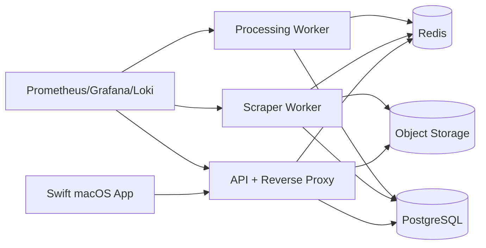

# infra.md

## 1. Deployment philosophy

Start with the simplest production topology that still supports:

- always-on crawling
- persistent storage
- observability
- safe backups
- source isolation
- operational debugging

Recommended baseline:

- PostgreSQL
- Redis
- object storage (S3-compatible)
- API service
- scraper worker service
- normalization/scoring/alert worker service
- reverse proxy
- metrics/logging stack

This can run in either:

1. **single-node Docker Compose** on a Mac mini or VPS
2. **small multi-node deployment** later if scale justifies it

Do not start with Kubernetes unless an existing team/platform already requires it.

---

## 2. Recommended environments

## 2.1 Local development
Use Docker Compose for:

- PostgreSQL
- Redis
- MinIO
- optional Prometheus/Grafana
- optional mail sandbox

Run from the host:

- API
- scraper workers
- Swift app

This keeps browser debugging easy.

## 2.2 Production (single-node)
Run all backend services in Docker Compose on:

- Mac mini
- small dedicated server
- VPS with enough RAM for Playwright + Postgres

Recommended production services:

- `postgres`
- `redis`
- `minio` or external S3
- `api`
- `worker-scraper`
- `worker-processing`
- `nginx`/`caddy`
- `otel-collector`
- `prometheus`
- `grafana`
- `loki` (optional)

Security defaults:

- keep `API_TRUST_PROXY=false` unless a real reverse proxy is terminating traffic in front of the API
- keep `/docs` bearer-protected in production unless you have an explicit public-docs override and network controls
- scrape `/metrics` on the main API port with a dedicated bearer token instead of exposing a separate unauthenticated metrics port

## 2.3 Production (scaled)
If needed later, separate:

- API
- scraper workers
- processing workers
- databases
- observability stack

Still keep PostgreSQL as the source of truth.

---

## 3. Service responsibilities

## 3.1 API service
Owns:

- REST endpoints
- auth
- read models
- filter CRUD
- alert state mutations
- manual run triggers
- SSE stream

Does not own:

- browser automation
- heavy async processing

## 3.2 Worker: scraper
Owns:

- discovery jobs
- detail jobs
- Playwright runtime
- raw snapshot persistence
- scrape run metrics

### Scaling note
Scale this separately from the API because browser jobs are memory-heavy.

## 3.3 Worker: processing
Owns:

- normalization jobs
- listing versioning
- baseline jobs
- scoring jobs
- reverse filter matching
- alert dispatching

## 3.4 Scheduler
Can be:

- a small dedicated process
- or part of the processing worker under leader election / single-instance rule

Responsibilities:

- read `sources`
- create repeatable jobs based on crawl intervals
- open/close source circuit breakers
- schedule canary runs
- schedule baseline refreshes

---

## 4. Queueing and orchestration

## 4.1 Queue choice
Use BullMQ on Redis.

Queues:

- `crawl.discovery`
- `crawl.detail`
- `normalize.raw-listing`
- `score.listing`
- `alerts.match`
- `alerts.dispatch`
- `maintenance.baselines`
- `maintenance.source-health`

## 4.2 Why not cron-only
Cron is fine for kicking off the scheduler, but not sufficient for job state and retries.

Use cron or system timer only to:

- start the scheduler loop
- run backup jobs
- run housekeeping jobs

All crawl/process work should be durable queue work.

## 4.3 Idempotency
Queue delivery is at-least-once. The database must enforce correctness:

- raw snapshot uniqueness
- current listing uniqueness
- version uniqueness
- alert dedupe uniqueness

---

## 5. Storage layout

## 5.1 PostgreSQL
Stores:

- source registry
- run audit
- raw snapshot metadata
- canonical listings
- history
- scores
- filters
- alerts

### Backup
- nightly full backup
- WAL archiving or equivalent point-in-time strategy if available
- restore test on a schedule

## 5.2 Object storage
Bucket structure example:

```text
immoradar/
  raw-html/{sourceCode}/{yyyy}/{mm}/{dd}/{uuid}.html.gz
  screenshots/{sourceCode}/{yyyy}/{mm}/{dd}/{uuid}.png
  har/{sourceCode}/{yyyy}/{mm}/{dd}/{uuid}.har.gz
```

### Retention
- HTML and screenshots: retain long enough for parser debugging and replay
- consider moving older artifacts to cold storage
- do not delete artifacts required for unresolved parser regressions

## 5.3 Redis
Used for:

- queue state
- delayed jobs
- transient circuit-breaker keys
- short-term distributed locks

Do not store irreplaceable business state only in Redis.

---

## 6. Configuration model

Keep all runtime configuration externalized.

### Examples
- database URL
- Redis URL
- object storage bucket
- API base URL
- source-specific rate limit overrides
- browser mode
- artifact capture flags
- email/webhook alert config

### Principle
Configuration changes should not require code changes for basic operations like:

- pausing a source
- reducing crawl rate
- changing alert sender
- switching object storage bucket

---

## 7. Networking

## 7.1 Reverse proxy
Place the API behind Caddy or Nginx for:

- TLS termination
- auth forwarding if needed
- request logging
- compression
- SSE-friendly config

## 7.2 Outbound policy
Allow outbound access only where needed:

- listing source domains
- object storage
- mail provider or webhook targets
- auth provider if used

## 7.3 Browser networking
Playwright workers must have:

- stable outbound connectivity
- DNS that resolves source domains reliably
- optionally isolated IPs if source reputation becomes a factor

---

## 8. Observability stack

## 8.1 Logs
Recommended path:

- application logs -> OTEL collector / Loki / cloud log sink

Required fields:

- timestamp
- level
- service
- source_code
- scrape_run_id
- listing_key
- job_id
- error_class

## 8.2 Metrics
Recommended exporters:

- Prometheus scrape endpoint
- Grafana dashboards

Key metrics:

- crawl success/failure by source
- parse success/failure by source
- page latency
- queue depth
- worker concurrency
- block/captcha count
- normalization throughput
- scoring latency
- alert delivery success rate
- API p95 latency

## 8.3 Traces
Trace across:

- manual trigger -> scheduler -> queue -> worker -> DB writes
- normalization -> scoring -> alert matching
- API request -> SQL query -> response

This is especially helpful when freshness lags.

---

## 9. Deployment topology examples

## 9.1 Small single-user production



## 9.2 Self-hosted on Mac mini
If the backend runs on a Mac mini:

- keep it powered and always on
- use launchd or Docker restart policies
- do not rely on the foreground Swift UI process
- expose the API locally or over a private network
- still back up Postgres off-machine

---

## 10. Scheduling model

## 10.1 Source cadence
Store cadence in `sources.crawl_interval_minutes`, then let the scheduler decide exact run times.

Use different profiles:

- high-priority Vienna profiles more often
- broad Austria profiles less often
- canary profiles even when a source is degraded
- backfill profiles at low priority

## 10.2 Load smoothing
Avoid all sources firing at the same minute.

Add jitter to scheduled enqueue times so that:

- source load is smoothed
- queue spikes are reduced
- rate-limit collisions are less likely

---

## 11. Housekeeping jobs

Implement background maintenance for:

- source health recalculation
- stale scrape run cleanup
- artifact lifecycle transitions
- baseline recomputation
- score replay on formula changes
- unread alert count refresh if materialized
- backup verification report

---

## 12. Security

## 12.1 Secrets
Use one of:

- 1Password service account
- Vault
- platform secret store
- environment files only for local development

## 12.2 Data at rest
- disk encryption where possible
- database backup encryption
- object storage server-side encryption
- Keychain for desktop tokens

## 12.3 Access control
- least privilege for buckets
- app/API tokens scoped to read/write needs
- no public raw artifact URLs
- audit manual run triggers if remote

---

## 13. Backup and disaster recovery

## 13.1 Database
- nightly full backup
- optional incremental/WAL strategy
- retention window documented
- restore test scheduled

## 13.2 Object storage
- bucket versioning if available
- lifecycle policy with non-immediate deletion
- critical parser-debug artifacts retained long enough

## 13.3 Recovery objectives
Define realistic goals:

- RPO: acceptable data loss window
- RTO: acceptable recovery time

For a single-investor deployment, the main practical goal is:
- do not lose listing history and filters
- recover service within hours, not days

---

## 14. Release strategy

## 14.1 Backend
- build immutable images
- tag with git SHA and semantic version
- run migrations before app rollout
- keep rollback strategy documented

## 14.2 Scraper changes
- deploy new parser version
- run canary jobs first
- inspect parse success and source health
- only then ramp full cadence

## 14.3 App
- version the macOS app separately
- keep API backwards-compatible across app minor releases
- prefer additive API changes

---

## 15. Capacity planning

## 15.1 Resource hotspots
Expect main load from:

- Playwright browser memory
- raw artifact storage growth
- `raw_listings` / `listing_versions` table growth
- list-search API queries under heavy filtering

## 15.2 Practical starting sizes
Adjust to real traffic, but expect:

- scraper workers need materially more RAM than API
- PostgreSQL needs enough disk IOPS and RAM for active indexes
- object storage grows faster than DB for verbose artifact capture

## 15.3 Scale-out order
Scale in this order:

1. more scraper workers
2. more processing workers
3. stronger PostgreSQL instance / storage
4. separate object storage if local disk is tight
5. only later consider more complex orchestration

---

## 16. Anti-bot operations

Infrastructure should support anti-bot-safe behavior:

- per-source concurrency caps
- source-specific pause switches
- canary-only mode
- temporary source disable
- optional proxy support behind feature flag if legally approved

Do not make operational staff change code just to slow down one source.

---

## 17. Final recommendation

Deploy the system as a **small service bundle with clear separation between API, scraper workers, processing workers, PostgreSQL, Redis, and object storage**.

That gives:

- always-on operation
- operational visibility
- replayability
- safe backups
- room to grow without premature complexity
