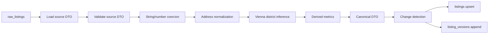

# normalization.md

## 1. Purpose

Normalization converts heterogeneous source output into one canonical listing model that supports:

- fast filtering
- scoring
- alerting
- analytics
- historical replay
- future ML feature extraction

The normalizer is a **separate pipeline stage**. Scrapers emit source-shaped DTOs. The normalizer emits canonical listing versions.

---

## 2. Pipeline overview



### 2.1 Processing stages

1. load raw snapshot
2. validate source DTO shape
3. coerce types
4. normalize strings and whitespace
5. map source fields to canonical fields
6. infer Vienna-specific fields where safe
7. compute derived fields
8. detect meaningful change
9. append history and update current state

---

## 3. Canonical listing schema

## 3.1 Identity

- `source_id`
- `source_listing_key`
- `source_external_id`
- `canonical_url`
- `current_raw_listing_id`
- `content_fingerprint`
- `normalization_version`

## 3.2 Transaction and type

- `operation_type` — `sale` or `rent`
- `property_type` — `apartment`, `house`, `land`, `commercial`, `parking`, `other`
- `property_subtype` — freeform source-mapped detail such as `altbau`, `penthouse`, `maisonette`

## 3.3 Descriptive content

- `title`
- `description`
- `source_status_raw`
- `normalized_payload` for overflow/source-specific fields

## 3.4 Location

- `city`
- `federal_state`
- `postal_code`
- `district_no` (Vienna municipal district number only)
- `district_name`
- `street`
- `house_number`
- `address_display`
- `latitude`
- `longitude`
- `geocode_precision`

## 3.5 Commercial data

- `list_price_eur_cents`
- `monthly_operating_cost_eur_cents`
- `reserve_fund_eur_cents`
- `commission_eur_cents`

## 3.6 Property facts

- `living_area_sqm`
- `usable_area_sqm`
- `balcony_area_sqm`
- `terrace_area_sqm`
- `garden_area_sqm`
- `rooms`
- `floor_label`
- `floor_number`
- `year_built`
- `condition_category`
- `heating_type`
- `energy_certificate_class`

## 3.7 Amenities / flags

- `has_balcony`
- `has_terrace`
- `has_garden`
- `has_elevator`
- `parking_available`
- `is_furnished`

## 3.8 Derived fields

- `price_per_sqm_eur`
- `completeness_score`
- `first_seen_at`
- `last_seen_at`
- `last_price_change_at`
- `last_content_change_at`
- `last_status_change_at`
- `current_score`

---

## 4. Canonical DTO contract

Recommended TypeScript input to persistence:

```ts
export type CanonicalListingInput = {
  sourceId: number;
  sourceListingKey: string;
  sourceExternalId?: string | null;
  currentRawListingId: number;
  latestScrapeRunId: number;
  canonicalUrl: string;

  operationType: "sale" | "rent";
  propertyType: "apartment" | "house" | "land" | "commercial" | "parking" | "other";
  propertySubtype?: string | null;

  title: string;
  description?: string | null;
  sourceStatusRaw?: string | null;

  city: string;
  federalState?: string | null;
  postalCode?: string | null;
  districtNo?: number | null;
  districtName?: string | null;
  street?: string | null;
  houseNumber?: string | null;
  addressDisplay?: string | null;
  latitude?: number | null;
  longitude?: number | null;
  geocodePrecision?: "source_exact" | "source_approx" | "street" | "district" | "city" | "none" | null;

  listPriceEurCents?: number | null;
  monthlyOperatingCostEurCents?: number | null;
  reserveFundEurCents?: number | null;
  commissionEurCents?: number | null;

  livingAreaSqm?: number | null;
  usableAreaSqm?: number | null;
  balconyAreaSqm?: number | null;
  terraceAreaSqm?: number | null;
  gardenAreaSqm?: number | null;
  rooms?: number | null;
  floorLabel?: string | null;
  floorNumber?: number | null;
  yearBuilt?: number | null;
  conditionCategory?: string | null;
  heatingType?: string | null;
  energyCertificateClass?: string | null;

  hasBalcony?: boolean | null;
  hasTerrace?: boolean | null;
  hasGarden?: boolean | null;
  hasElevator?: boolean | null;
  parkingAvailable?: boolean | null;
  isFurnished?: boolean | null;

  normalizedPayload: Record<string, unknown>;
  completenessScore: number;
  contentFingerprint: string;
  normalizationVersion: number;
};
```

---

## 5. Mapping strategy

## 5.1 Source DTO -> canonical DTO
Every source produces a typed raw DTO. The normalizer maps that DTO to canonical fields using a source-specific mapper.

Recommended structure:

```text
packages/normalization/
  src/
    canonical/
      types.ts
      validators.ts
      enrichments.ts
    sources/
      willhaben.mapper.ts
      immoscout24.mapper.ts
```

### 5.2 Mapping rules
Each mapper should define:

- required source fields
- optional source fields
- field-level coercion rules
- enum normalization rules
- fallback precedence
- default values
- provenance metadata

### 5.3 Provenance
Keep provenance in `normalized_payload` or side metadata, e.g.:

```json
{
  "provenance": {
    "price": "payload.priceRaw",
    "living_area": "payload.livingAreaRaw",
    "district": "postal_code_inference"
  },
  "warnings": ["rooms_missing", "floor_unparsed"]
}
```

This makes debugging much easier.

---

## 6. Normalization rules by field class

## 6.1 Strings
Apply in order:

1. Unicode normalize
2. trim
3. collapse repeated whitespace
4. normalize line endings
5. preserve original casing in descriptive fields
6. use case-insensitive matching for inference only

### Examples
- `"  3-Zimmer   Eigentumswohnung "` -> `"3-Zimmer Eigentumswohnung"`
- `"Landstrasse"` may map to district alias `"Landstraße"` for inference, but original raw text remains preserved in raw data

## 6.2 Numbers
Use tolerant numeric parsers for source text such as:

- `€ 299.000`
- `299000`
- `299.000,00`
- `58 m²`
- `3 Zimmer`
- `2,5 Zimmer`

Rules:

- prices normalize to integer euro cents
- sqm normalize to decimal numeric
- rooms normalize to decimal with one fractional digit
- unparseable strings become `NULL` plus warning

## 6.3 Booleans
Map from text and attribute presence:

- `ja`, `yes`, `vorhanden`, `mit`, icon presence -> `true`
- `nein`, `ohne`, icon absence where explicit -> `false`
- otherwise `NULL`

Never invent `false` just because a field is missing.

## 6.4 Dates/times
Normalize all timestamps to UTC in storage. Use the source timezone only for parsing if the page contains a local published time.

---

## 7. Missing and malformed data handling

## 7.1 Missing fields
Missing values are expected. The system should tolerate them.

Policy:

- required identity fields missing => normalization fails, retain raw only
- important but non-fatal fields missing => store `NULL` and warning
- listing remains searchable on available dimensions

### Hard-fail fields
- `source_id`
- `source_listing_key`
- `canonical_url`
- `operation_type`
- `property_type`
- `title`
- at least one usable location hint (`city`, `postal_code`, or district text) for Vienna-targeted flows

### Soft-fail fields
- rooms
- year built
- commission
- energy certificate
- floor number
- amenities

## 7.2 Malformed values
For malformed values:

- keep raw value in raw DTO
- store normalized field as `NULL`
- attach warning in normalized metadata
- do not crash the entire normalization run unless identity is affected

### Example
`"Preis auf Anfrage"` should not become `0`. It should become:

- `list_price_eur_cents = NULL`
- warning `price_not_numeric`

---

## 8. Vienna district normalization

This is one of the most important parts of the system because investor filters often target exact districts.

## 8.1 Canonical district lookup

| Nr. | District | Common aliases / signals |
|---:|---|---|
| 1 | Innere Stadt | 1. Bezirk, 1010, Innenstadt |
| 2 | Leopoldstadt | 2. Bezirk, 1020 |
| 3 | Landstraße | Landstrasse, 3. Bezirk, 1030 |
| 4 | Wieden | 4. Bezirk, 1040 |
| 5 | Margareten | 5. Bezirk, 1050 |
| 6 | Mariahilf | 6. Bezirk, 1060 |
| 7 | Neubau | 7. Bezirk, 1070 |
| 8 | Josefstadt | 8. Bezirk, 1080 |
| 9 | Alsergrund | 9. Bezirk, 1090 |
| 10 | Favoriten | 10. Bezirk, 1100 |
| 11 | Simmering | 11. Bezirk, 1110 |
| 12 | Meidling | 12. Bezirk, 1120 |
| 13 | Hietzing | 13. Bezirk, 1130 |
| 14 | Penzing | 14. Bezirk, 1140 |
| 15 | Rudolfsheim-Fünfhaus | Rudolfsheim Fuenfhaus, Rudolfsheim-Funfhaus, 15. Bezirk, 1150 |
| 16 | Ottakring | 16. Bezirk, 1160 |
| 17 | Hernals | 17. Bezirk, 1170 |
| 18 | Währing | Waehring, 18. Bezirk, 1180 |
| 19 | Döbling | Doebling, 19. Bezirk, 1190 |
| 20 | Brigittenau | 20. Bezirk, 1200 |
| 21 | Floridsdorf | 21. Bezirk, 1210 |
| 22 | Donaustadt | 22. Bezirk, 1220 |
| 23 | Liesing | 23. Bezirk, 1230 |


## 8.2 Normalization inputs
Potential inputs for district inference:

- explicit district number in address text, e.g. `2. Bezirk`
- district name, e.g. `Leopoldstadt`
- Vienna postal code, e.g. `1020`
- coordinates
- source category path
- free-text title/description as weak fallback only

## 8.3 Inference precedence
Use the following order:

1. **explicit district number** in structured address or title
2. **district name alias** match in structured address
3. **postal code inference** for standard Vienna district postcodes
4. **coordinate lookup** if geocoded and district polygons are available
5. **weak text inference** only if high confidence and no contradiction

### 8.4 Postal code inference rule
Infer district only when all are true:

- city is Vienna/Wien or highly likely Vienna
- postal code is four digits
- postal code is between `1010` and `1230`
- postal code ends in `0`

Then:

- district = middle two digits (or full district number for 10–23)

Examples:

- `1020` -> district 2
- `1030` -> district 3
- `1190` -> district 19
- `1230` -> district 23

Do **not** infer a district from non-standard Vienna-related postal codes or ambiguous addresses.

## 8.5 Contradiction handling
If source fields disagree:

- explicit district number beats postal-code inference
- structured address beats title text
- coordinate polygon beat weak text inference
- contradictions should generate a normalization warning

Example:

- postal code says `1030`
- title says `2. Bezirk`
- structured address says `Landstraße`

Result:

- use district 3
- log warning: `district_conflict_title_vs_address`

## 8.6 Non-Vienna listings
For Austria-wide listings outside Vienna:

- leave `district_no = NULL`
- store city/postal/federal state normally
- optionally add future non-Vienna district models later

---

## 9. Property type normalization

Use a controlled mapping table.

### Recommended canonical property types

- `apartment`
- `house`
- `land`
- `commercial`
- `parking`
- `other`

### Source-to-canonical examples

- `Eigentumswohnung`, `Wohnung`, `Apartment`, `Penthouse`, `Maisonette` -> `apartment`
- `Haus`, `Einfamilienhaus`, `Reihenhaus`, `Villa` -> `house`
- `Grundstück`, `Baugrund` -> `land`
- `Büro`, `Geschäftslokal`, `Praxis`, `Zinshaus` -> `commercial`
- `Garage`, `Stellplatz` -> `parking`

`property_subtype` preserves the finer-grained label.

---

## 10. Price per m² calculation

## 10.1 Primary formula

```text
price_per_sqm_eur = list_price_eur / effective_area_sqm
```

Where:

- `list_price_eur = list_price_eur_cents / 100`
- `effective_area_sqm = living_area_sqm` if present, otherwise `usable_area_sqm`

## 10.2 Rules

- if price is missing -> `NULL`
- if effective area is missing or zero -> `NULL`
- never divide by zero
- round to two decimal places for storage/display
- keep raw price and area provenance for auditability

## 10.3 Why living area wins
Investment comparisons are more meaningful when using living area first. Usable area can include elements that distort direct apartment comparisons.

---

## 11. Content fingerprinting

Generate a deterministic `content_fingerprint` from the canonical fields that materially affect investment decisions.

Recommended included fields:

- title
- description
- list price
- area
- rooms
- property type/subtype
- district/postal/city
- amenities
- status

Recommended excluded fields:

- `last_seen_at`
- crawl timestamps
- raw artifact keys
- source response headers

This prevents version churn from non-business changes.

---

## 12. Completeness score

Use a simple 0–100 completeness score to reflect data quality.

Suggested weights:

- price present: 20
- area present: 20
- city/postal/district present: 20
- description present: 10
- rooms present: 10
- source key + canonical URL: 10
- major amenities / floor / condition present: 10

Completeness score is not the opportunity score. It is a confidence proxy.

---

## 13. Change detection

A new `listing_versions` row should be created only when one of these changed:

- listing status
- price
- area
- rooms
- title
- description
- location attributes
- amenity/condition fields used in score/filter logic

### Do not version-bump for
- `last_seen_at`
- scrape run ID only
- identical normalized snapshot
- object storage pointers only

### Version reason examples
- `first_seen`
- `price_change`
- `content_change`
- `status_change`
- `relist_detected`

---

## 14. Geocoding strategy (planned, not required in v1)

## 14.1 Rules
- never geocode synchronously in the scrape loop
- queue geocoding separately
- cache by normalized address hash
- trust source coordinates first if plausible
- store geocode precision and provider

## 14.2 Suggested flow
1. source provides lat/lon -> use if valid
2. if absent and address sufficiently precise -> enqueue geocode job
3. cache result
4. optionally resolve district polygon from coordinates

## 14.3 Provider strategy
Prefer one of:

- self-hosted Nominatim/Pelias for control
- licensed provider with caching rights
- official municipal/address datasets when available

Do not call public geocoding services at high volume from the main pipeline.

---

## 15. Example normalized record

```json
{
  "sourceId": 1,
  "sourceListingKey": "willhaben:12345678",
  "canonicalUrl": "https://example-source/listing/12345678",
  "operationType": "sale",
  "propertyType": "apartment",
  "propertySubtype": "altbau",
  "title": "3-Zimmer Eigentumswohnung",
  "city": "Wien",
  "postalCode": "1020",
  "districtNo": 2,
  "districtName": "Leopoldstadt",
  "listPriceEurCents": 29900000,
  "livingAreaSqm": 58.4,
  "rooms": 3,
  "pricePerSqmEur": 5119.86,
  "hasElevator": true,
  "completenessScore": 86,
  "contentFingerprint": "sha256:...",
  "normalizationVersion": 1
}
```

---

## 16. Quality gates

A normalized record is accepted when:

- identity is complete
- canonical URL is valid
- property type and operation type are resolved
- no impossible numeric values remain
- district inference is either high-confidence or null
- content fingerprint computed successfully

If not, keep the raw snapshot and mark normalization failure for replay.

---

## 17. Final recommendation

Treat normalization as a first-class subsystem with:

- source DTO validation
- Vienna-specific district intelligence
- deterministic canonical mapping
- explicit warnings
- immutable versioning
- derived metrics ready for filters and scoring

That is what turns a scraper into an investment intelligence engine.
