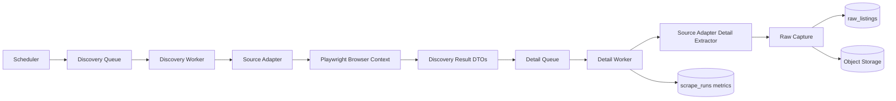

# scrapers.md

## 1. Scope and operating rules

This document defines the production scraper architecture for Austrian real estate sources, with Vienna purchase listings as the first high-priority segment.

Core rules:

- each source is isolated in its own module
- the scraper only captures raw/source-shaped data
- canonical normalization happens elsewhere
- every crawl is traceable via `scrape_runs`
- every raw snapshot is preserved via `raw_listings`
- anti-bot behavior is handled centrally and per-source
- selectors are treated as versioned code, not throwaway scripts

---

## 2. Overall scraper architecture



### 2.1 Why split discovery and detail

Discovery pages are good for:

- finding candidate URLs quickly
- estimating listing volume
- incremental pagination

Detail pages are better for:

- stable source-local IDs
- richer attributes
- full description text
- status flags
- better dedupe keys

Use both. Do not trust discovery cards alone for canonical data.

---

## 3. Source module design

Each source lives in its own package.

```text
packages/
  scraper-core/
  source-willhaben/
  source-immoscout24/
  source-<future-site>/
```

### 3.1 Required files per source

```text
src/
  adapter.ts
  discovery.ts
  detail.ts
  dto.ts
  selectors.ts
  cookies.ts
  fingerprints.ts
  health.ts
  fixtures/
  tests/
```

### 3.2 Source adapter contract

```ts
export interface SourceAdapter<TDiscoveryDTO, TDetailDTO> {
  readonly sourceCode: string;

  buildDiscoveryRequests(profile: CrawlProfile): Promise<RequestPlan[]>;
  extractDiscoveryPage(ctx: DiscoveryContext): Promise<DiscoveryPageResult<TDiscoveryDTO>>;
  buildDetailRequest(item: DiscoveryItem<TDiscoveryDTO>): Promise<RequestPlan | null>;
  extractDetailPage(ctx: DetailContext): Promise<DetailCapture<TDetailDTO>>;
  deriveSourceListingKey(detail: DetailCapture<TDetailDTO>): string;
  canonicalizeUrl(url: string): string;
  detectAvailability(detail: DetailContext): SourceAvailability;
}
```

### 3.3 Contract boundaries

A source adapter may:

- click through cookie banners
- navigate pagination
- parse embedded JSON
- extract source-specific raw fields
- derive a source-local stable key
- identify source terminal status

A source adapter may **not**:

- infer Vienna district from text
- calculate canonical `price_per_sqm`
- decide opportunity score
- evaluate user filters
- write directly to `listings`

---

## 4. Playwright strategy

## 4.1 Browser choice
Default:

- Playwright + Chromium

Fallbacks:

- Playwright + Firefox if a source behaves materially better there
- headed Chromium under Xvfb for sources with strong headless heuristics

Do not create per-source ad-hoc browser stacks unless absolutely necessary.

## 4.2 Browser pool
Use a managed browser pool with bounded contexts.

Recommended defaults:

- one browser instance per worker process
- one to three contexts per domain depending on source tolerance
- one page per context at a time for fragile sources
- periodic context rotation to avoid memory leaks and stale sessions

### 4.3 Context configuration
Set stable context defaults:

- locale: `de-AT`
- timezone: `Europe/Vienna`
- user-facing language headers that match Austria/German usage
- realistic viewport sizes sampled from a small allowed set
- downloads disabled unless needed
- images allowed only if the site requires them for full rendering
- JavaScript enabled by default

### 4.4 Request interception
Use request interception sparingly:

- block obvious analytics/ads when safe
- never block XHR/fetch endpoints until verified non-essential
- preserve scripts that populate embedded listing JSON

### 4.5 Page load strategy
Prefer:

1. navigate to URL
2. wait for a known stable selector or embedded data container
3. read structured data if available
4. use DOM parsing as fallback
5. capture HTML and diagnostics on failure

Do not rely on fixed sleep alone.

---

## 5. Anti-bot mitigation

The objective is **stability and politeness**, not brute-force evasion.

## 5.1 Mandatory controls

### Delay envelopes
Use jittered delays:

- 2–7 seconds between result pages
- 500–1500 ms between clicks/interactions
- 10–60 seconds cool-down after soft failure or suspicious response
- longer random pauses every N pages on fragile sources

### User agents
Maintain a small curated user-agent set per browser family, not hundreds of random strings.

Rules:

- rotate within a realistic set
- align UA with actual browser engine/version
- keep locale/timezone consistent with UA profile

### Headless detection avoidance
Use the following baseline hardening:

- disable obvious automation flags where Playwright allows
- initialize realistic `navigator.languages`
- preserve browser-like permissions behavior
- keep WebGL/canvas/browser fingerprinting internally consistent
- prefer headed mode for sources that consistently detect headless mode

Do **not** attempt to break access controls or solve CAPTCHAs automatically.

### Session reuse
Re-use cookies and session state for a bounded time window when that reduces suspicion.

Rules:

- store consent/cookie state per source profile
- rotate sessions after block suspicion or fixed max lifetime
- isolate sessions across sources

### Concurrency limits
Low concurrency is a feature, not a bug.

Recommended starting point:

- 1 concurrent context per fragile source
- 2 for tolerant sources
- increase only after observing stable block rates

## 5.2 Block detection signals

Treat these as soft/hard anti-bot signals:

- HTTP 403 / 429
- interstitial challenge page
- empty result sets where data should exist
- sudden selector absence across all pages
- unusual redirection loops
- CAPTCHA text or challenge DOM markers

When detected:

1. capture evidence
2. slow the source immediately
3. open a source circuit breaker if repeated
4. notify source health dashboard

## 5.3 What not to do

- no CAPTCHA solving services in v1
- no credential stuffing
- no scraping behind authentication unless explicitly approved
- no infinite retry loops
- no aggressive proxy rotation by default

---

## 6. Data capture model

Each successful detail fetch should produce a `DetailCapture` object shaped like:

```ts
type DetailCapture<T> = {
  sourceCode: string;
  sourceListingKeyCandidate?: string;
  externalId?: string | null;
  canonicalUrl: string;
  detailUrl: string;
  discoveryUrl?: string | null;
  responseStatus?: number | null;
  responseHeaders?: Record<string, string>;
  extractedAt: string;
  payload: T;
  htmlStorageKey?: string | null;
  screenshotStorageKey?: string | null;
  harStorageKey?: string | null;
  parserVersion: number;
  extractionStatus: "captured" | "parse_failed" | "blocked" | "not_found";
};
```

### 6.1 Prefer structured data when available
Extraction priority order:

1. embedded JSON / hydration state
2. JSON-LD
3. semantically labeled DOM attributes
4. visible DOM text
5. regex fallback on HTML only as last resort

This produces the most robust parsers and is far more resistant to cosmetic DOM changes.

### 6.2 Raw DTO, not canonical DTO
Each source defines its own raw DTO. Example:

```ts
type SourceRawListing = {
  titleRaw?: string | null;
  descriptionRaw?: string | null;
  priceRaw?: string | number | null;
  livingAreaRaw?: string | number | null;
  usableAreaRaw?: string | number | null;
  roomsRaw?: string | number | null;
  addressRaw?: string | null;
  postalCodeRaw?: string | null;
  districtRaw?: string | null;
  latRaw?: string | number | null;
  lonRaw?: string | number | null;
  attributesRaw?: Record<string, unknown>;
  mediaRaw?: unknown[];
};
```

Normalization later turns that into the canonical schema.

---

## 7. Pagination handling

## 7.1 Supported strategies
Implement explicit pagination modes per source:

- next-link navigation
- query-parameter page increment
- infinite scroll / lazy loading
- API-backed pagination discovered via XHR
- bounded “load more” button loop

### 7.2 Stop conditions
A discovery crawl stops when any of these occur:

- no next page
- repeated page fingerprint
- repeated listing ID set beyond threshold
- configured max pages reached
- source returns empty page unexpectedly after retries
- anti-bot suspicion exceeds threshold

### 7.3 Duplicate candidate suppression
Within a single discovery run, maintain a per-run set of:

- canonicalized detail URLs
- discovered source IDs where available

This avoids detail-job spam caused by duplicate cards across pagination or sort variations.

---

## 8. Retry strategy

## 8.1 Error classes

### Transient network
Examples:

- navigation timeout
- DNS resolution issue
- connection reset
- browser crash

Policy:

- retry up to 3 times
- exponential backoff with jitter
- fresh page, same context first
- fresh context on final retry

### Soft anti-bot
Examples:

- intermittent 403/429
- interstitial challenge
- suspicious redirect

Policy:

- retry once after cool-down
- then open source circuit breaker
- downgrade source health
- avoid hammering the domain

### Parse failure
Examples:

- expected selector missing
- embedded JSON absent
- schema validation failed

Policy:

- retry once with fresh context
- if still failing, save artifacts and mark source degraded
- do not endlessly retry parser bugs

### Terminal page state
Examples:

- listing removed
- 404
- source explicitly says unavailable

Policy:

- no retry
- write raw status snapshot
- let normalization update listing status

## 8.2 Retry budgets
Define retry budgets per job type.

Recommended defaults:

- discovery page: 3 attempts
- detail page: 3 attempts
- normalization: 2 attempts
- scoring: 2 attempts
- alerts: 5 attempts for delivery only

---

## 9. Failure handling and source health

## 9.1 On every failure capture
Store or reference:

- URL
- source code
- job ID
- scrape run ID
- screenshot
- HTML snapshot
- parser version
- browser version
- error class
- failure timestamp

## 9.2 Source health model
A source health score should consider:

- crawl success rate
- parse success rate
- anti-bot signal frequency
- average response time
- freshness lag from target cadence

### Health states

- `healthy`
- `degraded`
- `blocked`
- `disabled`

## 9.3 Circuit breaker behavior
Open the circuit when:

- repeated 403/429 responses
- challenge page ratio spikes
- parse failures spike across many pages

When open:

- pause new jobs for the source
- allow only low-frequency canary jobs
- require either auto-recovery threshold or manual re-enable

---

## 10. Handling DOM changes

## 10.1 Defensive extraction
Each critical field should have an extraction ladder.

Example:

- price from embedded JSON
- else from JSON-LD
- else from detail sidebar label/value pair
- else from fallback regex in page text

### 10.2 Fixture-based parser tests
For each source, maintain saved HTML fixtures for:

- normal detail page
- listing with missing optional fields
- sold/unavailable page
- cookie wall page
- anti-bot / challenge page
- discovery page with pagination

Run parser tests in CI.

### 10.3 Canary selectors
Maintain a canary crawl that hits a tiny stable subset of URLs and validates:

- title extracted
- price extracted
- source key extracted
- no challenge page

This detects breakage before a full crawl degrades silently.

### 10.4 DOM diff workflow
When a source changes:

1. compare new HTML snapshot with last known working fixture
2. identify selector breakage
3. patch only that source package
4. bump parser version
5. replay failed raw pages if needed

Do not hotfix shared core code unless the issue is actually shared.

---

## 11. Onboarding a new website

## 11.1 Source onboarding checklist

### Step 1: profile the site
- identify public entry points
- inspect robots/terms/legal status
- inspect pagination mode
- inspect cookie consent flow
- inspect availability of embedded data
- inspect listing ID stability
- inspect field completeness

### Step 2: create source package
- copy source template
- define DTOs
- define selectors
- define discovery logic
- define detail logic
- define source key derivation

### Step 3: build fixtures
- save representative discovery/detail pages
- add sold/unavailable cases
- add challenge/cookie examples

### Step 4: implement parser tests
- fixture tests
- source-key stability tests
- canonical URL tests
- blocked-page detection tests

### Step 5: dry run
- manual run against limited subset
- inspect raw snapshots
- inspect scrape run metrics
- inspect failure artifacts

### Step 6: canary deploy
- low-rate scheduler
- monitor success/parse/block rates
- tune delays/concurrency

### Step 7: production enablement
- enable regular cadence
- add to source health dashboard
- add runbook notes
- document source-specific quirks

---

## 12. Detail page extraction guidance

### 12.1 Stable field priority
Always prioritize extracting these reliably:

- source-local listing ID
- canonical URL
- title
- price
- living or usable area
- property type
- address/postal code/district text
- description
- status availability

### 12.2 Nice-to-have fields
Extract opportunistically:

- rooms
- floor
- year built
- heating
- energy certificate
- balcony/terrace/garden
- commission
- monthly operating costs
- coordinates

### 12.3 Status semantics
Model source status explicitly.

Examples of source signals that matter:

- reserved
- sold
- rented
- withdrawn
- inactive
- archived
- not found

Do not collapse all missing pages into the same meaning.

---

## 13. Discovery page extraction guidance

### 13.1 Purpose
Discovery pages should answer:

- what listings exist now?
- what detail URLs should be visited?
- what is the crawl frontier?
- what is the apparent page count?

### 13.2 Minimal discovery payload
A discovery item should include:

```ts
type DiscoveryItem<T> = {
  detailUrl: string;
  canonicalUrl?: string | null;
  externalId?: string | null;
  summaryPayload: T;
  discoveredAt: string;
  sourceCode: string;
};
```

### 13.3 Avoid over-parsing discovery cards
Do not spend too much complexity extracting rich data from cards if detail pages are richer and more stable. Discovery should stay fast and resilient.

---

## 14. Performance and resource management

### 14.1 Keep workers bounded
Limits to enforce:

- max pages per worker lifecycle
- max memory per process
- browser context recycle threshold
- overall domain concurrency caps

### 14.2 Avoid unnecessary rendering
If a source exposes enough data via embedded JSON, do not perform extra clicks or interactions.

### 14.3 Prefer incremental discovery
Use source filters / query parameters to reduce crawl scope when possible:

- property type
- transaction type
- region/district
- sort order that keeps recent listings near the top

This reduces both cost and detection risk.

---

## 15. Testing strategy

## 15.1 Unit tests
- URL canonicalization
- source key derivation
- selector extraction helpers
- blocked-page detection

## 15.2 Fixture integration tests
- discovery parse from stored HTML
- detail parse from stored HTML
- unavailable page detection
- cookie flow handling

## 15.3 Staging smoke tests
- one-page live run against source
- verify no block
- verify required fields extracted

## 15.4 Regression tests
Every DOM-change bug gets:

- fixture saved
- parser test added
- issue linked to source package

---

## 16. Runbook expectations

Every source must have a runbook entry covering:

- source-specific login/auth status (ideally none)
- cookie banner behavior
- pagination mode
- stable ID strategy
- known anti-bot thresholds
- common failure signatures
- how to validate a hotfix quickly

---

## 17. Final recommendation

Build a **source-isolated Playwright crawler with discovery/detail separation, raw-first persistence, fixture-based testing, and explicit anti-bot pacing**.

The scraper is successful when:

- one source can run unattended
- failures are visible
- DOM changes are localized
- re-runs are idempotent
- adding source 2 is mostly source-package work rather than system rewrite
